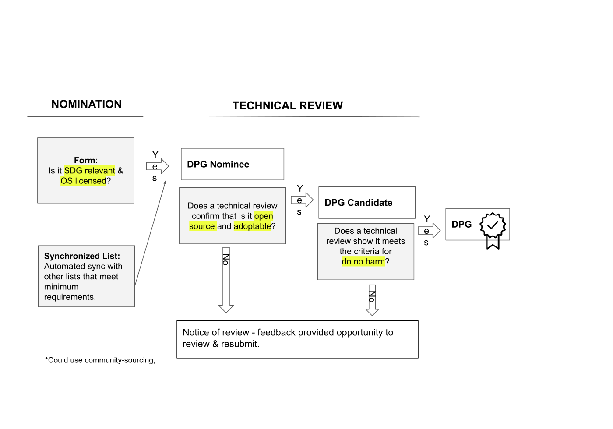

[![CC BY-SA 4.0][cc-by-sa-shield]](LICENSE)
[![Contributor Covenant][code-of-conduct-shield]](CODE_OF_CONDUCT.md)

 

    

<h1 align="center">Digital Public Goods Standard</h1>

The [Digital Public Goods Standard](standard.md) is a set of specifications and guidelines designed to maximize consensus about whether a project conforms to the definition of digital public goods set by the UN Secretary-General in the [2020 Roadmap for Digital Cooperation](https://www.un.org/en/content/digital-cooperation-roadmap/): *digital public goods must be open source software, open data, open AI models, open standards, and open content that adhere to privacy and other applicable laws and best practices, do no harm, and help attain the Sustainable Development Goals (SDGs).*

The DPG Standard establishes a baseline that must be met in order to earn recognition as a digital public good by the [Digital Public Goods Alliance](https://digitalpublicgoods.net) (DPGA) and the broader community. The DPG Standard is an open project and therefore [open to contribution](standard.md). The DPGA supports the [5 Core Principles of OpenStand](openstand.md) in the development of the DPG Standard. We invite anyone who uses and benefits from the DPG Standard to [join our growing list of endorsers](endorsement.md). 

## 🔎 Current Version

[The DPG Standard](standard.md) is currently at version 1.1.4, published on Jan. 29, 2021; view the [changelog](https://github.com/DPGAlliance/DPG-Standard/blob/master/CHANGELOG.md).

## ✅ Application of the DPG Standard

We encourage creators, maintainers, funders, implementers, and consumers to use this standard to recognize, assess, and support digital public goods. The standard is operationalized through a [questionary](https://app.digitalpublicgoods.net/form) that is required as part of the assessment process. We maintain a list of digital public goods that meet the DPG Standard described above on [our registry](https://digitalpublicgoods.net/registry). Projects are reviewed annually and archived if they do not continue to meet the Standard, as per our [archiving policy](archiving.md).

We apply the DPG Standard to projects that have either been [nominated directly](https://app.digitalpublicgoods.net/form) or have been pulled together from partnership databases. Projects that are submitted to our platform will undergo three stages of review to ensure they meet the requirements set in the DPG Standard. As a project undergoes various reviews it will move from **nominee** to a fully reviewed **digital public good**. 

Documentation submitted by candidates is transparently displayed on GitHub and can be [viewed here](https://github.com/unicef/publicgoods-candidates/pulls). If a project meets the DPG Standard it will be officially considered a digital public good and will appear as such in the DPG Registry, and may be eligible for additional recognition and support.

## 👍 Endorsements

The DPG Standard is endorsed by [a growing list](endorsement.md) of open source, open content, and open data advocacy and advancement experts. Endorsement means agreement with the DPG Standard set through the indicators, and a willingness to have your name and title publicly listed as having contributed to and endorsing the DPG Standard.

Add your endoresment by editing the [file](endorsement.md), and submitting a Pull Request or filling out [this form](https://forms.gle/knVvbv4mLfxkHtFS8).

## 🤗 Code of Conduct

The DPGA is dedicated to building a welcoming, diverse, and safe community. We expect everyone participating in the DPGA community to abide by our [**Code of Conduct**](CODE_OF_CONDUCT.md). Please read it. Please follow it. In the DPGA, we work hard to build each other up and create amazing things together. 💪💜

## ⚖️ Governance

At the DPGA, we envision a growing community of contributors and stakeholders around the DPG Standard in an open, transparent, and accessible manner. Our [governance](governance.md) documents the processes for welcoming, reviewing, and merging proposals for modifications to the DPG Standard and manages clear expectations around these processes.

## 🙏 Acknowledgements

Thank you to all the individuals that contributed to and [endorsed](endorsement.md) the DPG Standard, as well as well as to the participants of the **Early Grade Reading Community of Practice**. We also thank the following organizations: UNICEF,iSPIRT, Government of Sierra Leone, Government of Norway, and the DPGA Secretariat.

*Image Credit: [Badge](https://thenounproject.com/search/?q=seal+of+approval&i=32270) by André Luiz from [the Noun Project](http://thenounproject.com/), released under a CC license.*

## :memo: License

This repository is primarily content, and it is licensed under a [Creative Commons Attribution ShareAlike 4.0 International License](LICENSE).

[![CC BY-SA 4.0][cc-by-sa-image]](LICENSE)

> This is a human-readable summary of (and not a substitute for) the license.
> 
> You are free to:
> * **Share** — copy and redistribute the material in any medium or format
> * **Adapt** — remix, transform, and build upon the material for any purpose, even commercially.
> 
> The licensor cannot revoke these freedoms as long as you follow the license terms.
> 
> * **Attribution** — You must give appropriate credit, provide a link to the license, and indicate if changes were made. You may do so in any reasonable manner, but not in any way that suggests the licensor endorses you or your use.
> * **ShareAlike** — If you remix, transform, or build upon the material, you must distribute your contributions under the same license as the original.
>
> No additional restrictions — You may not apply legal terms or technological measures that legally restrict others from doing anything the license permits.

[cc-by-sa-image]: https://licensebuttons.net/l/by-sa/4.0/88x31.png
[cc-by-sa-shield]: https://img.shields.io/badge/License-CC%20BY--SA%204.0-lightgrey.svg
[code-of-conduct-shield]: https://img.shields.io/badge/Contributor%20Covenant-v2.0%20adopted-ff69b4.svg
